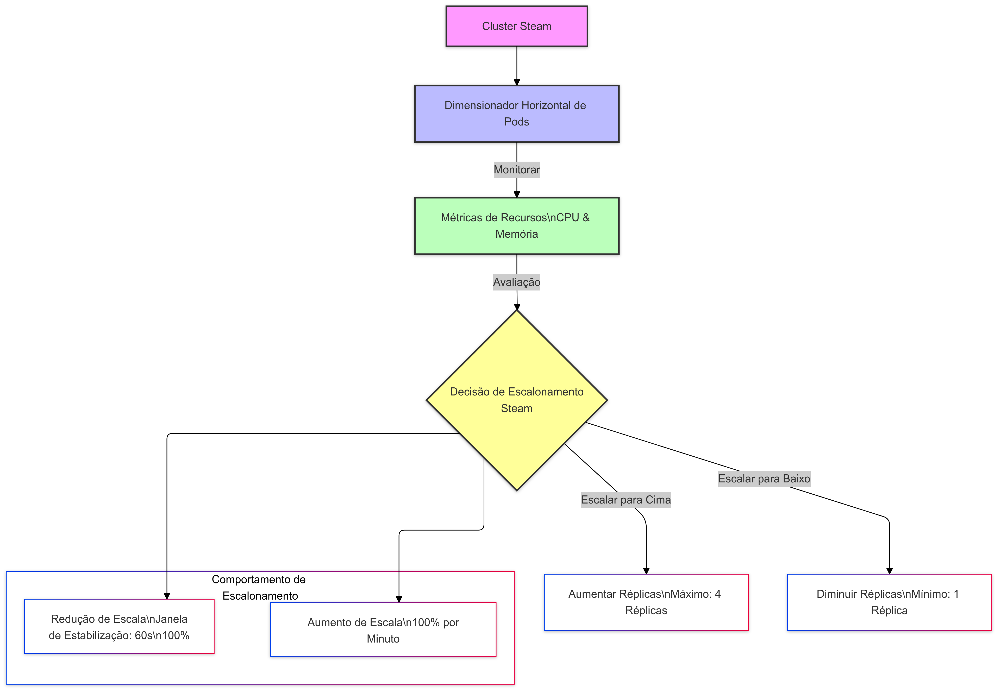

# Projeto Steam

## **Objetivo do Projeto**
 - Projeto de Monitoramento de Sensores da Caldeira Industrial.
 - Este projeto é destinado à leitura e processamento de dados provenientes de sensores instalados em uma caldeira industrial.
 - Os serviços principais, Producer e Consumer, desempenham os seguintes papéis:
  - Producer: Captura os dados em tempo real dos sensores da caldeira e os insere no sistema de mensageria RabbitMQ.
  - Consumer: Processa e analisa as mensagens recebidas, gerando insights ou acionando alertas em caso de anomalias ou falhas detectadas.
 - Este projeto utiliza Kubernetes para orquestrar serviço principal: `Consumer`. 
 - O `Producer` insere mensagens no RabbitMQ, enquanto o `Consumer` processa essas mensagens. 
 - O sistema usa o Helm para gerenciamento de deploys, e as imagens Docker dos serviços estão publicadas no Docker Hub.

## **Resultado**

 - Agora o ID do lote foi ajustado para ser baseado no timestamp do momento em que o lote é processado. 
 - O formato é `YYYY-MM-DD_HH-MM`, o que facilita a visualização de dados por minuto para gráficos temporais.
---

## **1. Pré-requisitos**
- Kubernetes configurado e funcional.
- `kubectl` instalado e configurado.
- Helm instalado.
- RabbitMQ instalado via Helm Chart.
- Acesso ao Docker Hub.

---

## **2. Configuração Inicial**

### **2.1 Configurando o RabbitMQ**
1. **Adicionar o repositório do Helm:**
   ```bash
   helm repo add bitnami https://charts.bitnami.com/bitnami
   ```

2. **Instalar o RabbitMQ:**
   ```bash
   helm upgrade --install --create-namespace --namespace steam rabbitmq bitnami/rabbitmq --version 15.0.6 -f resources/rabbitmq/values.yaml
   ```

3. **Acessar o RabbitMQ:**
   - Endereço: `http://127.0.0.1:15672/`
   - Para obter a senha:
     ```bash
     kubectl get secret rabbitmq -n steam -o jsonpath="{.data.rabbitmq-password}" | base64 --decode
     ```

4. **Alterar a senha do usuário:**
   ```bash
   kubectl exec -it rabbitmq-0 -n steam -- rabbitmqctl authenticate_user user <nova_senha>
   ```

---

## **3. Construção e Publicação de Imagens Docker**

### **3.1 Producer**
1. **Construir a imagem:**
   ```bash
   docker build --file resources/producer/Dockerfile --no-cache --tag manoelpg/producer:latest .
   ```

2. **Publicar no Docker Hub:**
   ```bash
   docker push manoelpg/producer:latest
   ```

### **3.2 Consumer**
1. **Construir a imagem:**
   ```bash
   docker build --file resources/consumer/Dockerfile --no-cache --tag manoelpg/consumer:test .
   ```

2. **Publicar no Docker Hub:**
   ```bash
   docker push manoelpg/consumer:test
   ```

---

## **4. Deploy das Aplicações com Helm**

### **4.2 Consumer**
1. **Deploy:**
   ```bash
   helm upgrade --install --create-namespace --namespace steam consumer ./helm -f helm/values.yaml
   ```

2. **Acessar o pod:**
   ```bash
   kubectl exec -it consumer-8578569c98-2mb44 -n steam -- bash
   ```

---

## **5. Verificação e Debug**

### **5.1 Verificar os Recursos no Kubernetes**
```bash
kubectl get all -n steam
```

### **5.2 Debug Containers**
- Executar o `Producer` para debug:
  ```bash
  kubectl run producer -n steam --image manoelpg/producer:latest
  ```
---

## **6. Desinstalação**

### **6.1 RabbitMQ**
```bash
helm uninstall -n steam rabbitmq
```

### **6.2 Consumer**
```bash
helm uninstall -n steam consumer
```

## **7. Upgrade**

### **7.1 Upgrade consumer**
```bash
helm upgrade --install --create-namespace --namespace steam consumer ./helm -f helm/values.yaml
```
## **8. Auto-scaling**



## Explicação do Dimensionador Horizontal de Pods (HPA) STEAM
- Visão Geral

      A configuração fornecida demonstra uma configuração avançada do Dimensionador Horizontal de Pods (HPA) no Kubernetes, projetado para ajustar dinamicamente o número de réplicas de pods com base na utilização de recursos.

- Detalhes Principais da Configuração
      Limites de Escalonamento

      Réplicas Mínimas: 1 pod
      Réplicas Máximas: 4 pods

- Gatilhos de Escalonamento
      O dimensionador tomará decisões de escalonamento com base em duas métricas principais:

      Utilização de CPU: Dispara escalonamento quando excede 70% da CPU alocada
      Utilização de Memória: Dispara escalonamento quando excede 70% da memória alocada

- Comportamento de Escalonamento

      Mecanismo de Redução de Escala
      Janela de Estabilização: 60 segundos
      Previne flutuações rápidas de escalonamento
      Permite tempo para o sistema se estabilizar antes de reduzir réplicas


- Política de Redução de Escala:

      Pode reduzir até 100% das réplicas atuais por minuto
      Ajuda a evitar quedas repentinas de capacidade

- Mecanismo de Aumento de Escala

      Política de Aumento de Escala:

      Pode aumentar até 100% das réplicas atuais por minuto
      Permite resposta rápida a aumentos de carga

- Benefícios

      Otimização Automática de Recursos: Ajusta dinamicamente recursos com base na demanda real
      Eficiência de Custos: Mantém o mínimo de réplicas necessárias durante períodos de tráfego baixo
      Manutenção de Desempenho: Escala rapidamente durante períodos de alta carga

- Práticas Recomendadas

      Monitore padrões reais de utilização de recursos
      Ajuste os limites com base nos requisitos específicos da aplicação
      Combine com o Dimensionador de Cluster para uma estratégia de escalonamento abrangente


### Comandos:
```bash
watch kubectl get hpa -A
```
```bash
watch kubectl get pods -n steam
```
### **9. Create/Delete cronjob**
```bash
make delete-jobs
```
```bash
make create-jobs
```
---

## **Exibe todos pods no namespace steam**
```bash
kubectl get pods -n steam
```

Atachar no container do consumer
```bash
kubectl exec -it -n steam consumer-84bdc6f7cc-2qppr -- bash
```
## **10. Deploy do Aplicativo Streamlit de Temperatura**

 - Comandos de Deploy
  
  - Para executar o deploy do aplicativo Streamlit de Temperatura, utilize os seguintes comandos:
  - Objetivo: Este comando constrói a imagem Docker do aplicativo Streamlit de temperatura e executa a imagem do aplicativo Streamlit de temperatura em um contêiner Docker.

   ```bash
   make deploy
   ```
## **11. Estrutura de Arquivos do Projeto**
- **`helm`**: Configurações de deployment do Helm Producer.
- **`resources/rabbitmq/values.yaml`**: Configurações específicas para o RabbitMQ.
- **`streamlit_app/`**:`Dockerfile`: Define a construção da imagem Docker do aplicativo Streamlit.
- **`streamlit_app/`**:`app.py`: Código Python que define a lógica do aplicativo Streamlit para visualização de dados de temperatura.


```bash
Projeto-Steam/
├── helm/                              # Configurações do Helm para o deploy das aplicações
│   ├── consumer/                      # Configuração de Helm para o Consumer
│   └── values.yaml                    # Configurações para o RabbitMQ e outras variáveis de ambiente
├── resources/                         # Recursos utilizados no projeto
│   ├── producer/                      # Código do Producer
│   │   └── Dockerfile                 # Dockerfile do Producer
│   ├── consumer/                      # Código do Consumer
│   │   └── Dockerfile                 # Dockerfile do Consumer
│   └── rabbitmq/                      # Arquivos de configuração do RabbitMQ
│       └── values.yaml                # Configurações específicas do RabbitMQ
├── docker-compose.yml                 # Arquivo Docker Compose para a configuração local
├── streamlit_app/                     # Novo diretório para o aplicativo Streamlit de Temperatura
│   ├── Dockerfile                     # Dockerfile do aplicativo Streamlit
│   ├── app.py                         # Código Python do aplicativo Streamlit
│   ├── requirements.txt               # Dependências para o aplicativo Streamlit
│   └── Makefile                       # Makefile para deploy do Streamlit
└── README.md                          # Arquivo de documentação do projeto
```